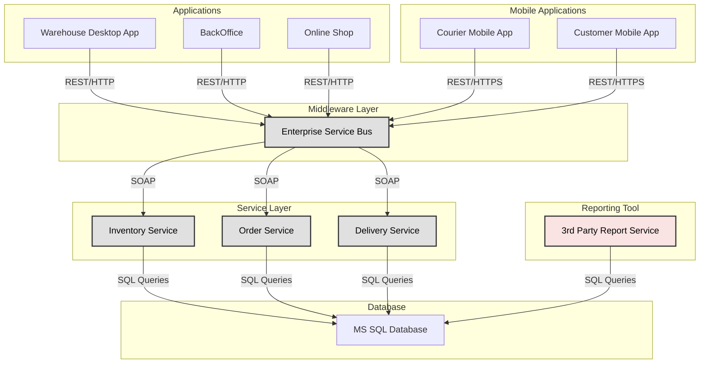

# Question 1. What are the cons and pros of the Monolith architectural style?

Pros:
1. Simple to develop at very start of the project - small team is able to work on it fast and efficient,
2. Simple to test - end2end tests can be conducted easly,
3. Simple to deploy - usually deploy requires to update files in one place,
4. Some usecases are simple to scale - applications can be copied and run independently.

Cons:
1. Scale of complexity of development raises expotencially with the project size - at some point it is very expensive to develop and mantain in both time and cost,
2. Hard to mantain - in some scenarios update in one module requires update in all packages - therefore continous deployment and integration is complex,
3. Low reliability - exception in one module can lead to errors in all modules,
4. Size of monolitic application can get to big to undestand the whole process.
   
# Question 2. What are the cons and pros of the Microservices architectural style?

Pros:
1. Easier to scale - microservices can be added easly,
2. Easier to mantain - many small code of microservices that can be mantained independently,
3. Easier to develop at same point - When the whole microservices infrastructure has been set up, adding or modifying microservices is easier,

Cons:
1. Complex initial setup - microservices are distrubuted system, therefore some proccess needs to be arranged beforehand,
2. Complex testing - microsoft dependencies needs to be inicialized or mocked beforehand,
3. Complex deployment - each microservice needs to be deployed, mantained and monitored independently.

# Question 3. What is the difference between SOA and Microservices?

SOA stands for Service-Oriented Architecture, and together with Microservices, they are types of architectural styles. The key differences are presented below:

1. Scope. SOA is better suited for large, enterprise-level, complex processes, while Microservices are typically better for application-scale smaller services.

2. Reusability. In SOA, reusability is one of the main goals. Code duplication is avoided, and a common infrastructure is established to be used across all services. In Microservices, code duplication is allowed, as it improves decoupling and decentralization.

3. Communication. SOA usually comes with an ESB (Enterprise Service Bus) that is used across all applications. SOA often relies on protocols like SOAP (Simple Object Access Protocol). On the other hand, Microservices typically use lightweight protocols such as HTTP/REST, among others.

4. Scalability. In SOA, scalability depends on the underlying technology and can be limited due to the size of the project and the centralized nature of SOA. Microservices, on the other hand, are decentralized and containerized, meaning that each microservice can be deployed and scaled independently using tools like Docker, for example. Moreover, because of their decentralization, Microservices can use completely different technologies or programming languages.

# Question 4. [Open question] What does hybrid architectural style mean? Think of your current and previous projects and try to describe which architectural styles they most likely followed.

A hybrid architectural style is a combination of different architectural styles within one project to fulfill specific needs, reinforce their strengths, and mitigate their disadvantages.
One of my previous projects was an application used by geologists in the oil and gas industry. The application was very large, and multiple developers participated in its development. It utilized well-established interfaces, common libraries, and protocols. The application also included developer tools for deploying plug-ins. Therefore, its architecture can be described as a combination of Service-Oriented Architecture (SOA) and Plug-in styles.
My current project is an E-commerce platform that includes a website for customers and a server with a database. Therefore, its architectural style can be clearly described as Client-Server.

# Question 5. Name several examples of the distributed architectures. What do ACID and BASE terms mean.

Examples of the distributed architectures can be as follow:
Client-server - client application can be spread across multiple phisical devices,
SOA - loosely coupled services can be distributed across multiple phisical devices,
Microservices - a system of independent servicess which can be hosted on a different clouds.

ACID stands for Atomicity, Consistency, Isolation, and Durability, and it is related to the relational databases. Usually used for banking or e-ccommerce where data consistency is required. This principle defines the features of the database system as follows:
Atomicity - makes sure that failed transactions are always rolled back,
Consistency - ensures that database is in correct state after the transaction,
Isolation - makes sure that transactions can be executed in parrarel,
Durability - once transaction is commited its result are stored in database.

BASE stands for Basically Available, Soft state, and Eventual consistency and it is related to the NoSQL databases. Ussually used for social media, massive multiplayer games or large projects where data might need some time to be propagated through the servers and become consistent at some point. It defines the following principles:
Basically available - database ensures availability of the data, even if some parts are not consistent,
Soft state - state of the system can change in time, even without input data.
Eventual consistency - ensures that database all nodes will have the same data, but it does not ensure immediate consistency.

# Question 6. Name several use cases where Serverless architecture would be beneficial.

Serverless architecture will be well suited for processes that require high scalability, flexibility and cost efficiency. Some examples are described below:
1. Payment processing microservices for e-commerce. This example is related to FaaS (function as a Service) which is a good option for building simple api. Processing payment requires high scalability and cost efficiency. Therefore a stateless functions can be implemented as microservices for handling payment processing.
2. Sending confirmation emails to users. This is an example for a serverless system that is event-driven based architecture. Whenever database got an update with a new order, the event is triggered to send a confirmation email with the order details. 
3. Push notifications. Information that is distributed accross mobile applications after an event occures. This is also an exaple of evend-driven architecture that demands high scalability.
4. User Authentication. This is an example for BaaS (Backend as a Service). This is a serverless system that provides some more complex functionality like user authentication (i.e. Auth0) and it is being outsourced to the third parties. This approach helps to mittigate need to manage infrastructure.

# Task 1

The current architectural style is a client-server. 
The given system clearly can be described by a client-server architecture, where server side is covered by the server with database and clients are the applications (warehouse app, manager app, customer app, courier mobile app, etc.), the 3rd party reporting service and the Mobile App Service.

# Task 2

Proposed architecture for the given system is SOA (Service Oriented Architecture). Graph of the SOA solution is depicted below:

The system that is depicted by the graph has some new components which are services layer and Enterprise servise bus used as communication hub. The architecture consist of the following sections:
1. Applications - set of web/desktop applications that are BackOffice, Warehouse desktop app and online shop,
2. Mobile applications - applications for mobile phones "Courier Mobile App" and "Customer Mobile App",
3. Communication hub (Enterprise Service Bus) - contral communication layer that ensures correct routing and data flow between applications and services,
4. Service layer - Services for handling busines related logic: Order service, Inventory service, delivery service,
5. Reporting tool - 3rd party reporting service that generates reports. In this system it is considered a legacy component,
6. Database storage - data is being stored in MS SQL database, be eqecuting sql queries.

One of the most important improvement of introducting SOA was adding service layer. This reinforced the system by making it scalable, maintanable and reliable. 
Each service is handling othe business logic, therefore:
1. Inventory service purpose is to check stock availability, update stocks for warehouse operations and manage inventory,
2. Order service purpose is to handle customers orders that icludes placing new oredrs, tracking order statuses, managing payments.
3. Delivery service purpose is to track shipment and delivery, assign couriers, sending notifications to Courier mobile app and Customer mobile app.

Another important improvement was to introduce Enterprise Service Bus for communication hub between applications, mobile apps and services. 
ESP is responsible for handling and routing request to the right service, ensures communication protocols, monitors and log the communication, provide and ensures security.

Communication protocols that are being used between applications and ESB were decided to be HTTP Rest calls. This is because of the simplicity of the REST calls and low latency that should be guaranteed by the UI applications for best User Experience. Moreover ESB secures communication by requring HTTPS for certain applications (Mobile applications), due to fact that those apps are operating in public network. Back office and Warehouse applications should have operate in private network, therefore HTTP should be optimal protocol.

In the other hand ESB is forwarting/routing the requests to the dedicated service using SOAP protocol, which ensures enterprise standards for service contract. 

Other layers remain unchanged therefore SOA appears to be well defined to improve architecture of client-server solutions.

The benefits and disadvantages of the two given solutions are described below.

# Client-server architecture
Pros:
1. Easy to develop - client-server architecture are easier to implement and develop for a small to medium projects,
2. Easy to test - due to centralization it is easier to conduct end2end tests,
3. Easy to mantain server - there is only one centrlized server with the database to be mantained.

Cons:
1. Limited scalability - large amount of server calls (i.e. due to black friday) can case system to slow down or even crash. Therefore system should be able to scale easly. Client-server architecture solves this issue only partially by vertical scalling (i.e. more power hardware) or by horizontal scalling (i.e. redundant servers),
2. Single point of failure - if the server goes down, the wole system becomes unavailable,
3. Reduced flexibility - business logic is tightly coupled with the server and database, which makes system more difficult for future improvements like adding new features. Such a modification might require extensive refactoring.
4. Reduced performance for larger systems - server will be responsible for handling requests, executing business logic and communicating with the database. For bigger systems this will cause delays in responses for thousands of requests.

# Service Oriented Architecture
Pros:
1. Modularity - different services working independently will make system more reliable. Changes applied to one service will not affect the other services,
2. Scalability - each service can be scalled independently, i.e. order service can be scalled up for higher traffic while inventory remain on normal traffic,
3. Fault isolation - error that occurs in one service, will not be propagate to other services, i.e. if inventory service crashes, the customers will still be able to place orders,
4. Reusability - services expose reusable API that can be used by different applications, therefore code duplication is lower,
5. Improved flexibility - due to standarised communication by ESB, it will be easier to scale or integrate new components without major refactoring.

Cons:
1. Complex deployment - additional layers of code to be implemented like ESB and separated services,
2. Increased development effort - developing additional layers will require more planing and testing,
3. SOA might be to complex and to expensive - small, low traffic systems might do not need such an architecture. Client-server can be better suited.
