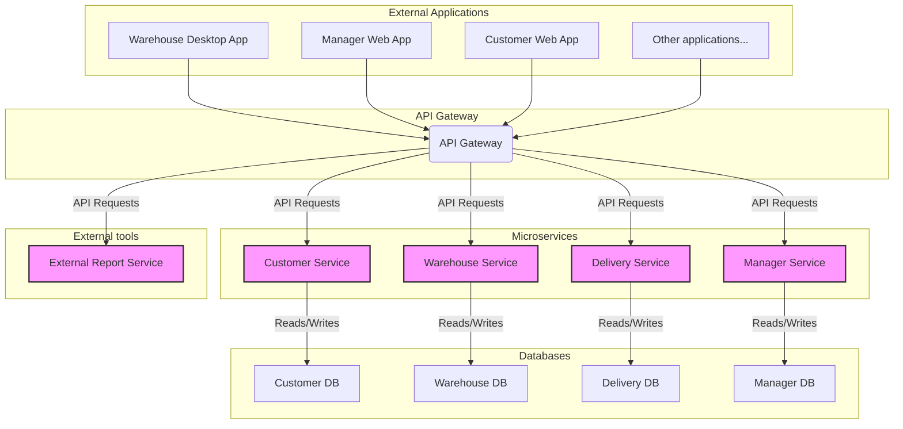

# Task 1
The current architectural style is a monolithic application. 
The reason it is a monolithic application is that, no matter how many different components there are, 
they are all connected to a single database. Therefore, a change in the database project requires changes in all components.

# Task 2
The second solution for designing an architecture for such a system might be a microservice architecture. 
Such an architecture can be presented in the diagram below.

In this example we can observe external applications which are calling API gateway in order to consume microservices. 
Each microservice uses its own db schema, which makes modules more loosly coupled.
Monolitic applications and microservices have different different features and usecases. Therefore we can describe their pros and cons.

# Monolitic architecture 
Pros:
1. Simple to develop at very start of the project - small team is able to work on it fast and efficient,
2. Simple to test - end2end tests can be conducted easly,
3. Simple to deploy - usually deploy requires to update files in one place,
4. Some usecases are simple to scale - applications can be copied and run independently.

Cons:
1. Scale of complexity of development raises expotencially with the project size - at some point it is very expensive to develop and mantain in both time and cost,
2. Hard to mantain - in some scenarios update in one module requires update in all packages - therefore continous deployment and integration is complex,
3. Low reliability - exception in one module can lead to errors in all modules,
4. Size of monolitic application can get to big to undestand the whole process,

# Microservices architecture
Pros:
1. Easier to scale - microservices can be added easly,
2. Easier to mantain - many small code of microservices that can be mantained independently,
3. Easier to develop at same point - When the whole microservices infrastructure has been set up, adding or modifying microservices is easier,

Cons:
1. Complex initial setup - microservices are distrubuted system, therefore some proccess needs to be arranged beforehand,
2. Complex testing - microsoft dependencies needs to be inicialized or mocked beforehand,
3. Complex deployment - each microservice needs to be deployed, mantained and monitored independently.
